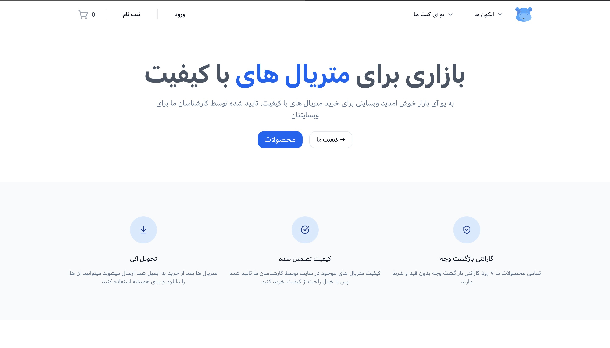
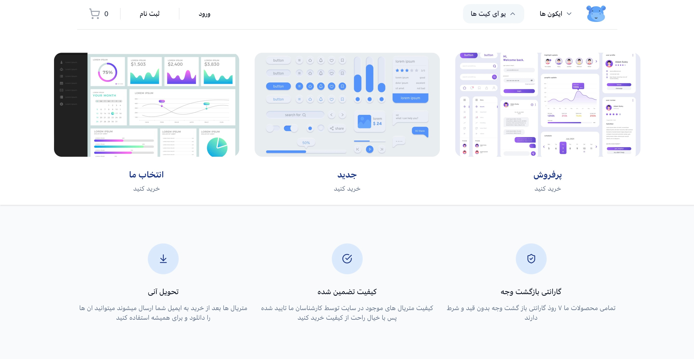
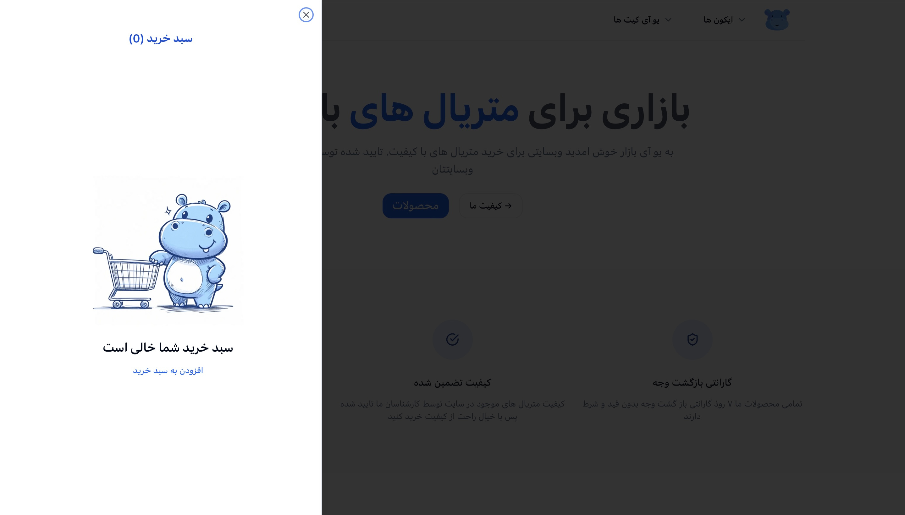
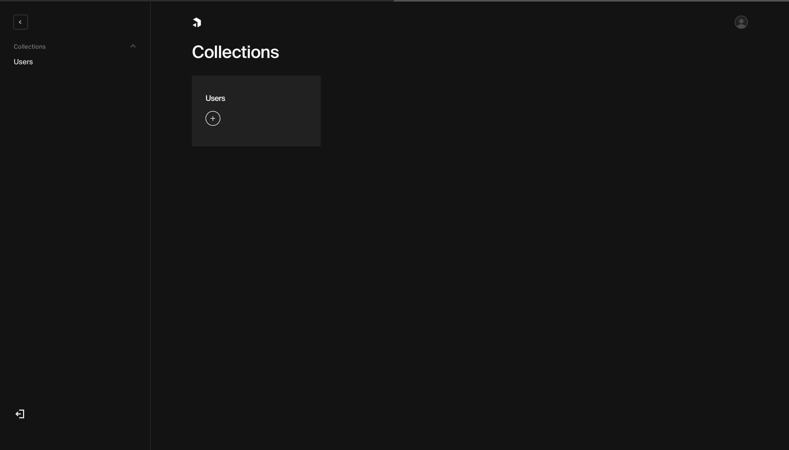

# UI Bazar
a practice project to deploy a fullstack e-commerce website for selling UI kits

written in typescript using next and react

tailwindcss and shadcnUi for styling

trpc for typesafty between front and backend

zod for form validation

payload headless cms for dashboard content management system 

